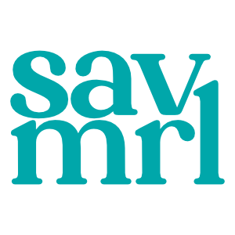
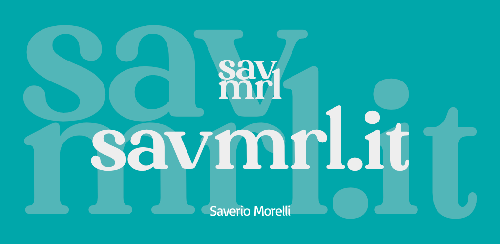

<h1 align="center">
     
    
     
    savmrl.it
     
</h1>

This is the official add-on for the https://savmrl.it service.

### What savmrl.it is

savmrl.it is an anonymous and free shortener and redirect service. It permits to get shorter links and also to track how many times your links have been opened.

You can use this service without any registration, just go to http://savmrl.it and start to use it!

### What is the add-on and where download it

The add-on permits you to have a shortcut: instead of copy the link you want to reduce and then paste it on the website, you’ll be able to create a reduced link **just pressing the add-on icon** on your toolbar. Easy, right?

You can download the add-on on [Firefox Add-ons](https://addons.mozilla.org/en-GB/firefox/addon/savmrl-it/), [Google Chrome Web Store](https://chromewebstore.google.com/detail/pkbjoeedhjjokllfhgcapbbihianeemn) and [Microsoft Edge Add-ons](https://microsoftedge.microsoft.com/addons/detail/jdgcfpdoiojfebhafmihkihficfnpahk)

### Support me and my work

If you like this project, leave a *Star* ⭐ to receive updates on your *GitHub dashboard*.

You can leave also a ⭐⭐⭐⭐⭐ *stars* review on your favourite web-browser store.

To support me, you can do a donation :smile: with **LiberaPay** or **PayPal**:

 [</img>](https://paypal.me/saveriomorelli)

### Screenshots

</img>

 
